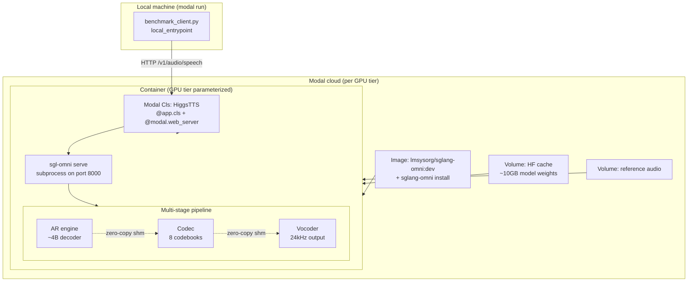

# Higgs TTS Modal Benchmark - Plan

## Goal Capsule

- **Objective:** Benchmark Higgs TTS 3 (`bosonai/higgs-audio-v3-tts-4b`) deployment on Modal across 5 GPU tiers to find the most cost-effective GPU for bursty, scale-to-zero traffic. Tiers that fail due to hardware incompatibility are documented and excluded.
- **Product authority:** User (developer) — research and cost evaluation, not production deployment.
- **Open blockers:** None. All product decisions resolved; technical risks (shared memory, snapshot compatibility, GPU image compatibility) are documented as assumptions with mitigation paths.
- **Execution profile:** `code` — Python project deploying SGLang-Omni on Modal with a benchmark client.
- **Stop conditions:** Cost per request and cost per audio second reported for all 5 GPU tiers; snapshot compatibility verdict documented; warm/cold break-even calculated; cost recommendation generated.

---

## Product Contract

Product Contract unchanged — all R-IDs, scope boundaries, success criteria, and dependencies preserved from the brainstorm. Planning enriches with implementation detail below.

### Summary

A Modal-based benchmark that deploys Higgs TTS 3 via SGLang-Omni across 5 GPU tiers (L4 $0.80/hr through H100 $3.95/hr), measuring cold start time, throughput, and cost per request for zero-shot and voice cloning patterns. The benchmark tests three cost dimensions: raw cold-start and throughput baseline, GPU memory snapshot compatibility, and warm-vs-cold break-even analysis.

### Problem Frame

The user needs to serve Higgs TTS 3 (Boson AI, ~4B params, BF16, 24kHz) for Vietnamese TTS with voice cloning. They confirmed it runs on consumer hardware (RTX 3060 12GB), making Modal's H100 ($3.95/hr) potentially overkill. Modal offers cheaper GPUs — the L4 at $0.80/hr is 5x cheaper than H100. The core question: which GPU tier delivers the best cost per request for bursty, scale-to-zero traffic, where cold start overhead (loading ~10GB model weights, initializing a multi-stage pipeline) factors significantly into effective cost? Published SGLang-Omni benchmarks on 1x H100 show 14.74 req/s at concurrency 16 with 617ms latency at concurrency 1. If throughput on cheaper GPUs degrades by less than the price ratio, the cheaper tier wins on cost per request.

### Key Decisions

- **SGLang-Omni over vLLM-Omni** as the serving framework — the user's existing clients already target SGLang-Omni's `/v1/audio/speech` API.
- **5 GPU tiers: L4, A10, L40S, A100-40GB, H100** — full sweep from cheapest viable ($0.80/hr) to reference ($3.95/hr) to find the cost sweet spot.
- **Three benchmark approaches combined (A+B+C)** — baseline cold start + throughput, snapshot compatibility test, and warm/cold break-even. More GPU spend on the experiment, but a complete cost picture for production decisions.
- **Zero-shot + voice cloning request patterns** — matching the user's actual use case (Vietnamese TTS with reference audio).
- **Scale-to-zero bursty traffic model** — cold start cost is a primary factor, not just steady-state throughput.
- **T4 excluded** — Turing architecture (SM 7.5) likely incompatible with flash-attn-4, which requires Ampere+; the cheapest viable tier starts at L4.

### Requirements

**Deployment**

- R1. Deploy Higgs TTS 3 on Modal using SGLang-Omni's `sgl-omni serve` command, not standard `sglang.launch_server` — the multi-stage pipeline (AR engine, codec, vocoder) is orchestrated differently.
- R2. Use the `lmsysorg/sglang-omni:dev` Docker image as the Modal image base, which ships UCX, flash-attn-4, and SGLang prebuilt.
- R3. Cache model weights (~10GB BF16) on a Modal Volume to avoid repeated HuggingFace downloads on each cold start.
- R4. Authenticate with `HF_TOKEN` for gated model access (`bosonai/higgs-audio-v3-tts-4b`).

**GPU Benchmark**

- R5. Benchmark across 5 GPU tiers: L4 ($0.80/hr), A10 ($1.10/hr), L40S ($1.95/hr), A100-40GB ($2.10/hr), H100 ($3.95/hr).
- R6. Measure cold start time per GPU — from container initialization to first successful audio response.
- R7. Measure throughput via concurrency sweep (1, 4, 8, 16 concurrent requests) per GPU, respecting VRAM limits on cheaper tiers.
- R8. Measure mean latency and RTF (real-time factor) per GPU at each concurrency level.

**Cost Analysis**

- R9. Calculate cost per request per GPU: `(cold_start_time + processing_time) x GPU_rate / num_requests`.
- R10. Calculate cost per second of audio generated per GPU.
- R11. Test GPU memory snapshot compatibility with SGLang-Omni; if compatible, measure cold start reduction versus no-snapshot baseline.
- R12. Measure warm-vs-cold break-even: determine the request rate at which keeping a warm container (`min_containers=1`) becomes cheaper than cold start overhead, per GPU tier.

**Request Patterns**

- R13. Benchmark zero-shot synthesis (text to audio, no reference clip).
- R14. Benchmark voice cloning (text + reference audio + transcript), with reference audio hosted on Modal (Volume or static endpoint), not via Tailscale HTTP.
- R15. Adapt the existing client pattern for Modal — reference audio must be fetchable from inside Modal containers, which cannot reach the user's Tailscale network.

### Scope Boundaries

- **Streaming / TTFA benchmark** — deferred; benchmark covers zero-shot + voice cloning only.
- **Inline control tokens** (emotion, style, prosody, SFX) — deferred.
- **Multi-GPU tensor parallelism** — deferred; single GPU per tier to isolate cost per GPU type.
- **vLLM-Omni alternative serving path** — deferred; SGLang-Omni is the chosen serving framework.
- **Production hardening** (auth, rate limiting, monitoring, custom domains) — outside scope; this is research.
- **Production deployment** — outside scope; the deliverable is benchmark data and a cost recommendation.

### Success Criteria

- Cost per request and cost per second of audio reported across all 5 GPU tiers.
- Cold start time measured per GPU tier.
- Snapshot compatibility verdict (works or does not work) with cold start reduction data if compatible.
- Warm/cold break-even request rate identified per GPU tier.
- Clear recommendation for the most cost-effective GPU tier for bursty, scale-to-zero Higgs TTS traffic.

### Dependencies / Assumptions

- The `lmsysorg/sglang-omni:dev` Docker image is compatible across L4 (Ada SM 8.9), A10 (Ampere SM 8.0), L40S (Ada SM 8.9), A100 (Ampere SM 8.0), and H100 (Hopper SM 9.0) — unverified; some tiers may require image adjustments.
- SGLang-Omni exposes `/release_memory_occupation` and `/resume_memory_occupation` endpoints for snapshot support — unverified; the multi-stage pipeline (separate AR/codec/vocoder processes) may not snapshot cleanly.
- The model fits in 24GB VRAM (L4/A10) with enough headroom for concurrency above 1 — unverified at higher concurrency levels.
- T4 exclusion is assumed, not tested — flash-attn-4 requires Ampere+ architecture.
- Modal's container runtime provides sufficient `/dev/shm` for SGLang-Omni's inter-process shared memory — unverified; the user's docker-compose sets `shm_size: 32g` with `ipc: host`. Modal does not expose `shm_size` or `ipc` settings. If `/dev/shm` is insufficient, the server may fail to start; U1 includes an early verification step.

### Outstanding Questions

**Deferred to Implementation**

- Exact SGLang-Omni server flags per GPU (`--cuda-graph-max-bs`, `--max-running-requests`) — depend on per-GPU VRAM headroom discovered at runtime.
- Max achievable concurrency per GPU tier — VRAM-limited; the concurrency sweep should gracefully degrade if higher concurrency levels OOM.
- Whether `sgl-omni serve` exposes `/release_memory_occupation` and `/resume_memory_occupation` — resolved empirically in U6.

### Sources / Research

- Higgs TTS 3 model card: <https://huggingface.co/bosonai/higgs-audio-v3-tts-4b>
- SGLang-Omni Higgs TTS cookbook: <https://sgl-project.github.io/sglang-omni/cookbook/higgs_tts.html>
- SGLang-Omni installation guide: <https://github.com/sgl-project/sglang-omni/blob/main/docs/get_started/installation.md>
- Modal SGLang low-latency example: <https://modal.com/docs/examples/sglang_low_latency>
- Modal SGLang snapshot example: <https://modal.com/docs/examples/sglang_snapshot>
- Modal pricing: <https://modal.com/pricing>
- Modal resource configuration (CPU, memory, disk): <https://modal.com/docs/guide/resources>
- vLLM on Modal gist (entrypoint/shm gotchas): <https://gist.github.com/lemonteaa/247305585fb0c52e473fbbf1dc2a4584>
- User's existing Docker setup: `speech/higgs-audio/server/Dockerfile`, `speech/higgs-audio/server/docker-compose.yml`
- User's existing voice cloning clients: `xiaomimimo/higgs_audio.py`, `speech/higgs-audio/client/higgs_tts_vi.py`
- Published SGLang-Omni benchmark (1x H100): 14.74 req/s @ concurrency 16, 617ms latency @ concurrency 1, RTF 0.147
- SGLang-Omni benchmark script reference: `benchmarks/eval/benchmark_tts_seedtts.py` in the sglang-omni repo

---

## Planning Contract

### Key Technical Decisions

**KTD1. `@app.cls` + `@modal.web_server` deployment pattern**

Use `@app.cls` with `@modal.web_server` rather than `@app.server`. The snapshot test (Approach B) requires `enable_memory_snapshot=True` on the class decorator, and `@modal.web_server` is the pattern used in the Modal snapshot example. Starting with this pattern means U6 (snapshot test) reuses the same server class rather than requiring a separate deployment. The `@app.server` pattern from the low-latency example does not support `enable_memory_snapshot`.

**KTD2. `lmsysorg/sglang-omni:dev` as Modal image base with in-image sglang-omni install**

Mirror the user's existing Dockerfile: use `modal.Image.from_registry("lmsysorg/sglang-omni:dev", add_python="3.12")`, override the entrypoint to `[]` (silence chatty logs), then clone sglang-omni and install via `uv pip install -e .` inside the image build. The image ships UCX, flash-attn-4, and CUDA prebuilt — manual installation of those prerequisites is the hardest part of SGLang-Omni setup and the Docker image solves it. The `add_python` parameter ensures Modal's platform post-processing has a Python to work with, since pre-packaged images may not expose it in the expected way (per the vLLM-on-Modal gist gotcha).

**KTD3. Model weights on Modal Volume with HF_TOKEN secret**

Mount a Modal Volume at `/root/.cache/huggingface` and set `HF_HUB_CACHE` to that path, matching the user's existing docker-compose volume mount. Download the model once via a `run_function` step during image build (or a separate warmup function on first run). Use `modal.Secret.from_name` for `HF_TOKEN`. Enable `HF_XET_HIGH_PERFORMANCE=1` for faster downloads, per Modal's SGLang examples. The model is gated and requires the token.

**KTD4. GPU type parameterized as class constructor argument**

Pass GPU type as a parameter to the Modal class constructor, allowing a single codebase to serve all 5 tiers. Each GPU tier deploys as a separate Modal App instance (or separate deployment with a different GPU argument). This avoids per-GPU code duplication while allowing per-GPU server flag tuning (KTD7).

**KTD5. Reference audio bundled on Modal Volume**

Copy the user's reference audio files (from `speech/voices/`) into a Modal Volume or directly into the container image. The SGLang-Omni server accepts `audio_path` as a local path or HTTP URL — a local path on the Volume is simplest. This replaces the user's Tailscale HTTP serving pattern, which Modal containers cannot reach. The reference transcript text is passed in the request body, not served.

**KTD6. Custom benchmark client via `local_entrypoint`**

Build a custom benchmark client as a Modal `local_entrypoint` rather than reusing SGLang-Omni's built-in `benchmark_tts_seedtts.py`. The built-in script measures throughput and latency but cannot measure cold start time (it assumes a running server) or calculate Modal-specific costs (GPU rate × time). The custom client sends zero-shot and voice cloning requests at controlled concurrency levels, timestamps cold start, and calculates cost metrics. The SGLang-Omni benchmark script's concurrency sweep methodology is referenced for approach.

**KTD7. Server flags auto-tuned per GPU VRAM**

Auto-detect available VRAM at container startup and adjust `--cuda-graph-max-bs` and `--max-running-requests` accordingly. On 24GB GPUs (L4, A10), lower CUDA graph batch sizes and max running requests to avoid OOM. On 40GB+ GPUs, use the published benchmark settings (`max_running_requests=16`). The auto-tuning logic runs before `sgl-omni serve` starts and passes the flags as command-line arguments.

### High-Level Technical Design



The benchmark client runs locally and sends HTTP requests to the Modal-deployed server. The server class starts `sgl-omni serve` as a subprocess, which orchestrates the multi-stage pipeline (AR engine, codec, vocoder) communicating via shared memory within the container. Model weights load from the HF cache Volume; reference audio reads from the reference Volume. Each GPU tier is a separate deployment with a different GPU type argument.

### Output Structure

```
higgs-modal-benchmark/
├── higgs_modal.py           # Modal app: image, server class, volumes, secrets
├── benchmark_client.py      # Benchmark client: concurrency sweep, metrics, cost calc
├── reference_audio/          # Reference audio files for voice cloning
│   └── ENG_UK_M_DaveB.wav   # converted from speech/voices/ENG_UK_M_DaveB.mp3
├── results/                  # Benchmark results (JSON + summary)
└── README.md                 # How to run the benchmark
```

---

## Implementation Units

### U1. Modal App Scaffolding and Image Setup

**Goal:** Create the Modal app, build the container image from `lmsysorg/sglang-omni:dev`, configure Volumes and secrets, and verify shared memory availability.

**Requirements:** R1, R2, R3, R4

**Dependencies:** None (first unit)

**Files:** `higgs_modal.py`

**Approach:**
- Define `modal.App("higgs-tts-benchmark")`.
- Build image: `modal.Image.from_registry("lmsysorg/sglang-omni:dev", add_python="3.12")`, set `entrypoint([])`, then `run_commands` to clone sglang-omni and `uv pip install -e .` inside the image. Set `PATH` to include the venv. Install `requests` and `aiohttp` for the benchmark client.
- Define `modal.Volume.from_name("higgs-hf-cache", create_if_missing=True)` mounted at `/root/.cache/huggingface`. Set `HF_HUB_CACHE` and `HF_XET_HIGH_PERFORMANCE` env vars.
- Define `modal.Volume.from_name("higgs-ref-audio", create_if_missing=True)` for reference audio.
- Define `modal.Secret.from_name("huggingface-secret")` for `HF_TOKEN`.
- Add a `run_function` step or separate function to download the model (`hf download bosonai/higgs-audio-v3-tts-4b`) into the Volume on first run.
- Include a diagnostic function that checks `df -h /dev/shm` inside the container and logs the result — this verifies shared memory is sufficient before building the full server. If `/dev/shm` is under 1GB, log a warning since the multi-stage pipeline may fail.

**Patterns to follow:** Modal SGLang examples (`sglang_snapshot.py`, `sglang_low_latency.py`) for image/volume/secret patterns. User's existing `speech/higgs-audio/server/Dockerfile` for the sglang-omni install steps.

**Test scenarios:**
- Image builds successfully on Modal (`modal build` or first `modal run`).
- `/dev/shm` size is logged and is at least 1GB.
- Model download function populates the HF cache Volume.
- HF_TOKEN secret is accessible inside the container.

**Verification:** `modal run higgs_modal.py::check_shm` prints `/dev/shm` size. `modal run higgs_modal.py::download_model` completes without error and the Volume contains model files.

---

### U2. SGLang-Omni Server on Modal

**Goal:** Define the `@app.cls` server class that starts `sgl-omni serve` as a subprocess, health-checks it, and exposes it via `@modal.web_server`.

**Requirements:** R1, R6

**Dependencies:** U1

**Files:** `higgs_modal.py`

**Approach:**
- Define `HiggsTTS` class with `@app.cls(image=..., gpu=GPU_TYPE, volumes={...}, secrets=[...], enable_memory_snapshot=SNAPSHOT_ENABLED)`.
- Accept `gpu_type` and `snapshot_enabled` as constructor arguments for parameterization across tiers and benchmark modes.
- In `@modal.enter()` (or `@modal.enter(snap=True)` for snapshot mode), build the `sgl-omni serve` command with `--model-path bosonai/higgs-audio-v3-tts-4b --host 0.0.0.0 --port 8000` plus auto-tuned flags (KTD7). Start it as `subprocess.Popen`.
- Implement `wait_ready()` helper: poll `http://127.0.0.1:8000/health` until 200 or timeout (20 minutes — model loading is slow on first cold start).
- Implement `warmup()`: send a zero-shot request to prime CUDA graphs and caches.
- For snapshot mode: call `/release_memory_occupation` after warmup, then `sleep()`. On restore (`@modal.enter(snap=False)`), call `/resume_memory_occupation`.
- Decorate a `serve` method with `@modal.web_server(port=8000, startup_timeout=20*60)` — this proxies Modal's HTTP routing to the SGLang-Omni server.
- Set `@modal.concurrent(target_inputs=TARGET_INPUTS, max_inputs=MAX_INPUTS)` for request batching.
- Use `@modal.exit()` to terminate the subprocess.

**Patterns to follow:** Modal `sglang_snapshot.py` for the `@app.cls` + `@modal.web_server` + `@modal.enter(snap=True/False)` lifecycle. Modal `sglang_low_latency.py` for `wait_ready` and `warmup` helpers. User's `docker-compose.yml` for the `sgl-omni serve` command structure.

**Test scenarios:**
- Server starts and `/health` returns 200 within timeout on L4 GPU.
- Zero-shot request to `/v1/audio/speech` returns valid WAV audio.
- Server subprocess terminates cleanly on container shutdown.
- Cold start time (container init to first audio) is measurable and logged.

**Verification:** Deploy the server with `modal deploy higgs_modal.py`, then `curl -X POST <url>/v1/audio/speech -d '{"input":"Hello"}' --output test.wav` returns a valid WAV file. `file test.wav` confirms audio format.

---

### U3. Reference Audio Hosting on Modal

**Goal:** Upload reference audio files to a Modal Volume so the SGLang-Omni server can access them for voice cloning requests.

**Requirements:** R14, R15

**Dependencies:** U1

**Files:** `higgs_modal.py`, `reference_audio/`

**Approach:**
- Copy the user's reference audio file (from `speech/voices/ENG_UK_M_DaveB.mp3`) and its transcript (`speech/voices/ENG_UK_M_DaveB.txt`) into the `reference_audio/` directory. SGLang-Omni expects WAV for `audio_path`, so pre-convert the MP3 to `ENG_UK_M_DaveB.wav` (e.g., `ffmpeg -i ENG_UK_M_DaveB.mp3 ENG_UK_M_DaveB.wav`); ensure `ffmpeg` is available in the image (the base `lmsysorg/sglang-omni:dev` image should be checked, add `apt-get install -y ffmpeg` in the image build if missing).
- Add a Modal function that uploads these files to the `higgs-ref-audio` Volume using `modal.Volume.commit()`.
- In the server class, mount the reference Volume so `sgl-omni serve` can read reference audio via local file paths (e.g., `/ref_audio/ENG_UK_M_DaveB.wav`).
- Pass `--allowed-local-media-path /ref_audio` to `sgl-omni serve` so the server accepts local audio paths in requests.

**Patterns to follow:** Modal Volume upload patterns from Modal docs. User's `higgs_tts_vi.py` client for the reference audio + transcript request structure.

**Test scenarios:**
- Reference audio files are present on the Volume after upload.
- Voice cloning request with `audio_path: /ref_audio/ENG_UK_M_DaveB.wav` and `text: <transcript>` returns valid WAV with cloned voice.
- Reference audio is accessible from inside the container at the mounted path.

**Verification:** `curl -X POST <url>/v1/audio/speech -d '{"input":"Have a nice day","references":[{"audio_path":"/ref_audio/ENG_UK_M_DaveB.wav","text":"Sodi Scientifica has been designing and marketing traffic enforcement systems for nearly fifty years, with the goal of improving road safety and people s quality of life."}]}' --output cloned.wav` returns a valid WAV. (The reference `text` must match the spoken content of `ENG_UK_M_DaveB.wav`; full transcript is in `speech/voices/ENG_UK_M_DaveB.txt`.)

---

### U4. Benchmark Client — Zero-Shot and Voice Cloning

**Goal:** Build the benchmark client that sends zero-shot and voice cloning requests at controlled concurrency levels, measures cold start time, throughput, latency, and RTF, and collects raw metrics for cost analysis.

**Requirements:** R6, R7, R8, R13, R14

**Dependencies:** U2, U3

**Files:** `benchmark_client.py`

**Approach:**
- Define a `local_entrypoint` that accepts `--gpu-type`, `--mode` (cold/warm/snapshot), `--concurrency-levels` (default: 1,4,8,16), and `--pattern` (zero-shot/voice-cloning/both).
- Cold start measurement: record timestamp before first request, send a single zero-shot request, record timestamp when audio response arrives. The delta is cold start time.
- Concurrency sweep: for each concurrency level N, send N concurrent requests using `asyncio` + `aiohttp`, measure wall-clock time, calculate throughput (req/s), mean latency, and RTF (processing_time / audio_duration).
- Zero-shot pattern: `{"input": "Hello, how are you?"}` (English) and `{"input": "Xin chào, bạn có khỏe không?"}` (Vietnamese) — include both to match the user's Vietnamese TTS use case.
- Voice cloning pattern: `{"input": "Have a nice day and enjoy south california sunshine.", "references": [{"audio_path": "/ref_audio/ENG_UK_M_DaveB.wav", "text": "Sodi Scientifica has been designing and marketing traffic enforcement systems for nearly fifty years, with the goal of improving road safety and people s quality of life."}], "temperature": 0.8, "top_k": 50, "max_new_tokens": 1024}`. (The reference `text` must match `ENG_UK_M_DaveB.wav`; use the full transcript from `speech/voices/ENG_UK_M_DaveB.txt` in the actual benchmark.)
- Audio duration: parse the returned WAV header to extract duration, or use `wave` module. RTF is computed at concurrency=1 (server-side processing time / audio duration); at higher concurrency, client-observed latency includes queueing and is reported separately.
- Output raw metrics as JSON to `results/<gpu-type>_<mode>_<pattern>.json`.

**Patterns to follow:** SGLang-Omni `benchmark_tts_seedtts.py` for concurrency sweep methodology. Modal `sglang_low_latency.py` `probe` helper for async request sending with retry on 503. User's `higgs_tts_vi.py` for voice cloning request structure.

**Test scenarios:**
- Cold start measurement completes and produces a timestamp delta.
- Concurrency sweep at N=1 produces throughput and latency metrics.
- Concurrency sweep at N=16 either completes or fails gracefully with OOM logged (cheaper GPUs may not handle high concurrency).
- Voice cloning request returns audio with duration measurable from WAV header.
- Metrics JSON contains: gpu_type, mode, pattern, concurrency, throughput, mean_latency, rtf, cold_start_time, audio_duration_seconds.

**Verification:** `modal run benchmark_client.py --gpu-type L4 --mode cold --pattern both` produces JSON files in `results/` with all expected metric fields populated.

---

### U5. GPU Tier Sweep and Cost Analysis

**Goal:** Run the benchmark across all 5 GPU tiers, aggregate results, calculate cost per request and cost per audio second, and generate a comparison report.

**Requirements:** R5, R7, R8, R9, R10

**Dependencies:** U4

**Files:** `benchmark_client.py`, `results/`

**Approach:**
- Define GPU pricing constants: `L4=0.80, A10=1.10, L40S=1.95, A100_40=2.10, H100=3.95` (USD/hr, derived from Modal pricing per-second rates × 3600).
- For each GPU tier: deploy the server (or reuse deployment), run the benchmark client for both zero-shot and voice cloning patterns, collect results.
- Cost per request: `(cold_start_time + total_processing_time) * (gpu_rate / 3600) / num_requests`.
- Cost per audio second: `(cold_start_time + total_processing_time) * (gpu_rate / 3600) / total_audio_seconds`.
- Generate a summary table (markdown or printed) comparing all 5 tiers: GPU, price/hr, cold start, throughput@N, cost/req, cost/audio_sec.
- Identify the sweet spot: the tier with the lowest cost per request. Throughput is a secondary filter — tiers that cannot sustain concurrency ≥ 4 are flagged but not excluded, since cost per request is the primary metric for bursty traffic.

**Patterns to follow:** Published SGLang-Omni benchmark table format for the comparison table structure.

**Test scenarios:**
- All 5 GPU tiers produce results (or some fail gracefully with documented errors for incompatible tiers).
- Cost per request is calculated and non-negative for each tier.
- Cost per audio second is calculated and non-negative.
- Summary table includes all tiers that produced valid results.
- Sweet spot recommendation is generated and includes reasoning.

**Verification:** Running the full sweep produces a `results/summary.json` and a printed comparison table. The summary identifies the recommended GPU tier with cost per request and cost per audio second.

---

### U6. Snapshot Compatibility Test

**Goal:** Test whether SGLang-Omni's multi-stage pipeline supports Modal's GPU memory snapshotting, and if it does, measure the cold start reduction.

**Requirements:** R11

**Dependencies:** U2

**Files:** `higgs_modal.py`, `benchmark_client.py`

**Approach:**
- Deploy the server with `enable_memory_snapshot=True` and `experimental_options={"enable_gpu_snapshot": True}`.
- In `@modal.enter(snap=True)`: start `sgl-omni serve`, wait for health, warmup, then call `POST /release_memory_occupation`. If this endpoint does not exist (404), log "snapshot incompatible — endpoint not found" and mark the test as failed.
- In `@modal.enter(snap=False)`: call `POST /resume_memory_occupation`. If this fails, log the error.
- Measure cold start time with snapshot enabled (after first snapshot is taken) vs the baseline cold start from U4.
- Run on one GPU tier first (L4 — cheapest) to verify before testing others.
- If snapshot works: run on all 5 tiers and collect cold start reduction data.
- If snapshot fails: document the failure mode (endpoint missing, multi-stage process conflict, etc.) and skip snapshot testing on remaining tiers.

**Patterns to follow:** Modal `sglang_snapshot.py` for the `sleep()`/`wake_up()` lifecycle and `enable_memory_snapshot` configuration.

**Test scenarios:**
- Snapshot-enabled deployment builds and deploys without error.
- `/release_memory_occupation` endpoint either responds 200 (compatible) or 404 (incompatible).
- If compatible: cold start time with snapshot is measurably shorter than baseline.
- If incompatible: failure is documented with the specific error, and the benchmark continues without snapshot.

**Verification:** The test produces a `results/snapshot_verdict.json` with `{compatible: bool, cold_start_baseline_s: float, cold_start_snapshot_s: float|null, reduction_pct: float|null, failure_reason: string|null}`.

---

### U7. Warm/Cold Break-Even Analysis

**Goal:** Calculate the break-even request rate at which keeping a warm container becomes cheaper than cold start overhead, for each GPU tier.

**Requirements:** R12

**Dependencies:** U5, U6

**Files:** `benchmark_client.py`, `results/`

**Approach:**
- For each GPU tier, use the cold start time from U5 (or U6 if snapshot works) and the steady-state throughput.
- Warm cost: `gpu_rate / 3600 * seconds_alive` (paying for idle GPU time between requests).
- Cold cost per request: `cold_start_time * (gpu_rate / 3600) + processing_time * (gpu_rate / 3600)`.
- Break-even: the request rate (requests per minute) at which warm cost equals cold cost. Above this rate, warm is cheaper; below it, cold (scale-to-zero) is cheaper.
- Formula: `break_even_req_per_min = 60 / (cold_start_time + avg_processing_time)` — at this rate, the container is continuously busy and warm cost equals cold cost. Below it, idle time makes warm more expensive.
- Generate a table: GPU tier, cold start cost per cold request, warm cost per hour, break-even req/min.
- Include snapshot impact: if snapshot works, the reduced cold start shifts the break-even point.

**Patterns to follow:** Modal autoscaling docs for `min_containers` and `scaledown_window` semantics.

**Test scenarios:**
- Break-even is calculated for each GPU tier that produced valid results.
- Break-even table includes both no-snapshot and snapshot (if available) scenarios.
- The analysis identifies which tiers are most cost-effective for bursty traffic vs steady traffic.

**Verification:** `results/breakeven.json` contains per-tier break-even request rates. The printed summary includes a recommendation for bursty (scale-to-zero) traffic.

---

## Verification Contract

| Gate | Command | Applies to |
|------|---------|------------|
| Image builds | `modal build higgs_modal.py` | U1 |
| Shared memory check | `modal run higgs_modal.py::check_shm` | U1 |
| Model download | `modal run higgs_modal.py::download_model` | U1 |
| Server health | `curl <url>/health` returns 200 | U2 |
| Zero-shot audio | `curl -X POST <url>/v1/audio/speech -d '{"input":"Hello"}' --output test.wav` returns valid WAV | U2 |
| Voice cloning audio | `curl -X POST <url>/v1/audio/speech -d '{"input":"...","references":[...]}' --output cloned.wav` returns valid WAV | U3 |
| Cold start measured | `results/<gpu>_cold_zero-shot.json` contains `cold_start_time` field | U4 |
| Concurrency sweep | `results/<gpu>_cold_zero-shot.json` contains metrics for each concurrency level | U4 |
| Cost analysis | `results/summary.json` contains cost per request and cost per audio second for all valid tiers | U5 |
| Snapshot verdict | `results/snapshot_verdict.json` contains `compatible` boolean | U6 |
| Break-even | `results/breakeven.json` contains per-tier break-even rates | U7 |
| Cleanup | No dead-end experimental code in final diff; results JSON files are the only outputs | All |

---

## Definition of Done

**Global:**
- All 5 GPU tiers benchmarked with zero-shot and voice cloning patterns (or failures documented for incompatible tiers).
- Cost per request and cost per audio second reported for all valid tiers in a comparison table.
- Cold start time measured per GPU tier.
- Snapshot compatibility verdict documented (works/doesn't work) with cold start reduction data if applicable.
- Warm/cold break-even request rate calculated per GPU tier.
- Cost recommendation generated: which GPU tier is most cost-effective for bursty, scale-to-zero Higgs TTS traffic.
- Benchmark code is clean — no dead-end experimental code, no commented-out blocks, no debug prints left in.
- `README.md` documents how to run the benchmark and interpret results.

**Per-unit:**
- U1: Image builds, `/dev/shm` verified, model downloads to Volume, HF_TOKEN accessible.
- U2: Server starts, health check passes, zero-shot request returns valid WAV.
- U3: Reference audio accessible on Volume, voice cloning returns valid WAV with cloned voice.
- U4: Cold start measured, concurrency sweep produces metrics for both patterns.
- U5: All valid tiers have cost metrics, summary table generated, sweet spot identified.
- U6: Snapshot verdict documented (compatible or not, with evidence).
- U7: Break-even calculated per tier, recommendation for bursty traffic generated.